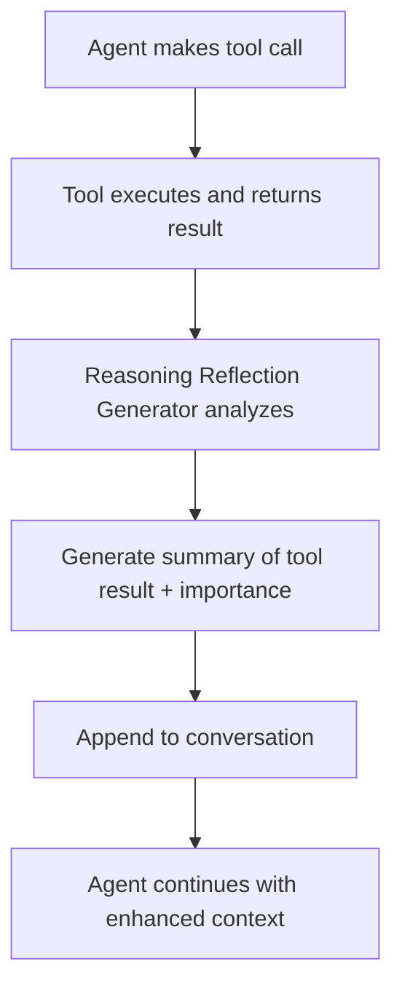

# Reasoning Reflection Feature

## Overview

The Reasoning Reflection feature is an innovative addition to tau-bench that enhances agent performance by providing structured summaries after each tool call iteration. After every tool call, the system generates a `<reasoning_reflection>` that summarizes:

1. **Information Retrieved**: What data/results were obtained from the tool call
2. **Relevance Assessment**: How important this information is to solving the original problem  
3. **Strategic Insights**: What this suggests for next steps

## How It Works



## Architecture

### Core Components

1. **`ReasoningReflectionGenerator`** (`tau_bench/agents/reasoning_reflection.py`)
   - Main class that generates reflections using LLM
   - Configurable model and provider
   - Fallback mechanism for robustness

2. **Integration Points**
   - `ToolCallingAgent`: Native tool calling with reflections
   - `ChatReActAgent`: ReAct/Act agents with reflections  
   - `FewShotToolCallingAgent`: Few-shot learning with reflections

3. **Configuration**
   - `enable_reasoning_reflection: bool` parameter in `RunConfig`
   - Enabled by default, can be disabled for comparison

## Usage

### Basic Usage

```python
from tau_bench.types import RunConfig
from tau_bench.run import run

# Enable reasoning reflection (default)
config = RunConfig(
    model_provider="openai",
    model="gpt-4o-mini",
    agent_strategy="tool-calling",
    enable_reasoning_reflection=True,  # 🧠 NEW FEATURE
    # ... other config
)

results = run(config)
```

### Disable for Comparison

```python
config = RunConfig(
    # ... same config ...
    enable_reasoning_reflection=False,  # Disable feature
)
```

## Example Output

### Without Reasoning Reflection
```
User: Book me a flight from NYC to LA
Assistant: I'll search for flights for you.
[Tool Call: search_direct_flight]
Tool Response: Found 3 flights: AA123 ($299), DL456 ($349), UA789 ($279)
Assistant: I found several options. Let me get your details to proceed.
[Tool Call: get_user_details]
```

### With Reasoning Reflection
```
User: Book me a flight from NYC to LA  
Assistant: I'll search for flights for you.
[Tool Call: search_direct_flight]
Tool Response: Found 3 flights: AA123 ($299), DL456 ($349), UA789 ($279)

<reasoning_reflection>
Successfully retrieved 3 direct flight options from NYC to LA with varying prices ($279-$349). This information is highly relevant (High importance) as it directly addresses the user's flight booking request. The price range suggests UA789 offers the best value. Next step should be to gather user preferences or details to proceed with booking the most suitable option.
</reasoning_reflection>

Assistant: I found several options. Let me get your details to proceed.
[Tool Call: get_user_details]
Tool Response: User: John Smith, Email: john@email.com, Frequent Flyer: Gold

<reasoning_reflection>
Retrieved user profile showing John Smith with Gold frequent flyer status. This information is highly relevant (High importance) as it enables personalized booking with potential upgrades and preferences. The Gold status may qualify for better seats or priority boarding. Ready to proceed with flight booking using the cheapest option (UA789) unless user specifies preferences.
</reasoning_reflection>
```

## Configuration Options

### ReasoningReflectionGenerator Parameters

```python
ReasoningReflectionGenerator(
    model="gpt-4o-mini",           # LLM model for generating reflections
    provider="openai",             # Model provider (openai, anthropic, etc.)
    temperature=0.0                # Temperature for reflection generation
)
```

### RunConfig Parameters

```python
RunConfig(
    # ... existing parameters ...
    enable_reasoning_reflection=True,  # Enable/disable the feature
)
```

## Benefits

### 🧠 Enhanced Reasoning
- Agents maintain better context across tool calls
- Explicit assessment of information relevance
- Strategic thinking about next steps

### 📊 Improved Performance
- Better decision making with structured reflection
- Reduced redundant tool calls
- More focused problem-solving approach

### 🔍 Debugging & Analysis
- Clear visibility into agent reasoning process
- Easy to identify where agents lose track
- Valuable for prompt engineering and improvement

## Implementation Details

### Reflection Generation Process

1. **Tool Call Execution**: Agent makes a tool call and receives response
2. **Context Analysis**: System analyzes the original task and current state
3. **LLM Reflection**: Separate LLM call generates structured summary
4. **Integration**: Reflection is added as system message to conversation
5. **Continuation**: Agent continues with enhanced context

### Smart Filtering

The system automatically skips reflection generation for:
- `respond` actions (final responses to users)
- `think` actions (internal reasoning steps)
- Other configurable action types

### Fallback Mechanism

If LLM reflection generation fails:
- System falls back to template-based reflection
- Ensures robustness and continued operation
- Logs errors for debugging

## Testing

### Run Test Suite

```bash
# Test the reflection generation system
python test_reasoning_reflection.py

# Run example with/without reflections
python example_with_reflection.py
```

### Manual Testing

```python
from tau_bench.agents.reasoning_reflection import ReasoningReflectionGenerator

# Create generator
reflection_gen = ReasoningReflectionGenerator()

# Test reflection generation
reflection = reflection_gen.generate_reflection(
    original_task="Book a flight to Paris",
    tool_call_info={"name": "search_flights", "arguments": {"destination": "CDG"}},
    tool_response="Found 5 flights, prices from $450-$890",
    current_context="Iteration 1/10"
)

print(reflection)
```

## Performance Considerations

### Computational Cost
- **Additional LLM Calls**: One reflection call per tool call
- **Token Usage**: ~100-300 tokens per reflection
- **Latency**: ~1-2 seconds additional per tool call

### Memory Usage
- **Conversation Length**: Increases by ~200-400 tokens per reflection
- **Context Window**: Monitor for context limit issues in long conversations

### Optimization Tips
- Use faster models (gpt-4o-mini) for reflection generation
- Adjust temperature=0.0 for consistent, focused reflections
- Consider disabling for simple, single-step tasks

## Comparison Studies

To evaluate the impact of reasoning reflection:

```python
# Run with reflection
results_with = run(RunConfig(..., enable_reasoning_reflection=True))

# Run without reflection  
results_without = run(RunConfig(..., enable_reasoning_reflection=False))

# Compare success rates, efficiency, etc.
compare_results(results_with, results_without)
```

## Future Enhancements

### Planned Features
- **Adaptive Reflection**: Skip reflections for simple/obvious tool calls
- **Reflection Quality Scoring**: Assess and improve reflection usefulness
- **Multi-Modal Reflections**: Support for image/document analysis
- **Reflection Chaining**: Build on previous reflections for deeper insights

### Integration Opportunities
- **Memory Systems**: Store important reflections for future reference
- **Learning Systems**: Use reflections to improve agent performance over time
- **Evaluation Metrics**: Develop metrics for reflection quality and impact

## Troubleshooting

### Common Issues

**Reflection Generation Fails**
```python
# Check API keys and model availability
# System will fall back to template-based reflections
```

**Context Window Exceeded**
```python
# Monitor conversation length
# Consider shorter reflections or periodic context pruning
```

**Performance Impact**
```python
# Disable for time-sensitive applications
config.enable_reasoning_reflection = False
```

### Debug Mode

```python
# Enable detailed logging
import logging
logging.basicConfig(level=logging.DEBUG)

# Check reflection generation
reflection_gen = ReasoningReflectionGenerator()
print(reflection_gen.should_generate_reflection(tool_info, iteration))
```

## Contributing

To contribute to the reasoning reflection feature:

1. **Test Cases**: Add test scenarios in `test_reasoning_reflection.py`
2. **Reflection Quality**: Improve the reflection generation prompts
3. **Performance**: Optimize reflection generation speed/cost
4. **Integration**: Add support for new agent types

---

*This feature represents a significant innovation in agent reasoning and context management. The structured reflections help agents maintain focus, assess progress, and make better decisions throughout complex multi-step tasks.*